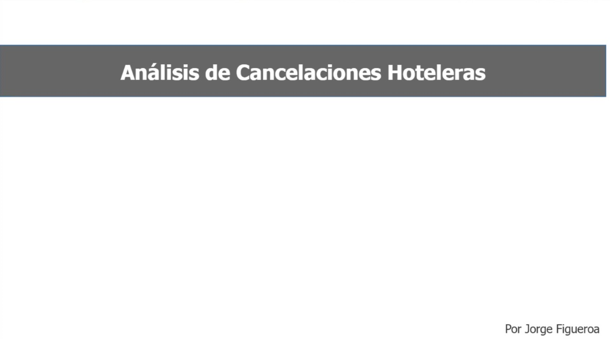

# Análisis de Cancelaciones Hoteleras
**Herramientas:** Power BI, Power Query, DAX

## Contexto del negocio
Una cadena hotelera detectó que estaba pagando comisiones a su agencia de marketing por reservas que luego se cancelaban. El objetivo fue cuantificar el impacto económico y entender qué tipo de reservas tienen mayor riesgo de cancelación.

## Dataset
- 119.390 reservas de 2015 a 2017
- 2 hoteles: City Hotel y Resort Hotel
- 31 variables por reserva

## Proceso
- Limpieza de datos en Power Query
- Modelado estrella con 5 dimensiones
- 10 medidas DAX para KPIs de negocio

## Hallazgos principales
- Tasa de cancelación general: **37%**
- Ahorro estimado renegociando contrato: **$66.336**
- Costo por cancelaciones de última hora: **$115.680**
- Reservas con +365 días de anticipación cancelan al **70%**
- Reservas con cambios o solicitudes especiales cancelan **a la mitad**

## Recomendaciones
1. Renegociar contrato con agencia para pagar solo por reservas materializadas
2. Implementar política de depósito para reservas con más de 90 días de anticipación
3. Incentivar interacción con la reserva para reducir cancelaciones

## Dashboard

